# SAGID - Sistema de Administración y Gestión de Instituciones Deportivas

## Descripción General

**SAGID** es una plataforma backend robusta diseñada para la administración y gestión integral de instituciones deportivas, clubes, centros y usuarios asociados. El sistema centraliza la gestión de usuarios, reservas, talleres, espacios deportivos, notificaciones, reportes y más, facilitando la operación diaria y la toma de decisiones en organizaciones deportivas de cualquier tamaño.

## Propósito

El propósito de SAGID es digitalizar y optimizar los procesos administrativos y operativos de instituciones deportivas, permitiendo:

- Gestión eficiente de usuarios, entrenadores, deportistas y personal administrativo.
- Administración de reservas de espacios y talleres deportivos.
- Control de acceso y membresías.
- Integración con dispositivos IoT y servicios en la nube (AWS, Arduino, Google Fit, etc.).
- Generación de reportes y estadísticas para la toma de decisiones.
- Notificaciones y comunicación interna.

## Estructura de Carpetas

La arquitectura del proyecto está organizada en módulos funcionales, siguiendo buenas prácticas de separación de responsabilidades.

```mermaid
graph TD;
  A["/ (root)"]
  A --> B["api/"]
  A --> C["controllers/"]
  A --> D["models/"]
  A --> E["routes/"]
  A --> F["config/"]
  A --> G["libs/"]
  A --> H["public/"]
  A --> I["views/"]
  A --> J["doc/"]
  A --> K["bin/"]
  A --> L["package.json"]
  A --> M["app.js"]
  B --> B1["access/"]
  B --> B2["aws/"]
  B --> B3["car/"]
  B --> B4["centros-deportivos/"]
  B --> B5["espacios-deportivos/"]
  B --> B6["gym/"]
  B --> B7["institucion/"]
  B --> B8["reservas/"]
  B --> B9["talleres/"]
  B --> B10["usuarios-complejos/"]
  B3 --> B3a["users/"]
  B6 --> B6a["controllers/"]
  B6 --> B6b["models/"]
  B6 --> B6c["routes/"]
  F --> F1["database.js"]
  G --> G1["docsStorage.js"]
  G --> G2["storage.js"]
  G --> G3["storageAWS.js"]
  H --> H1["stylesheets/"]
  I --> I1["index.ejs"]
  I --> I2["error.ejs"]
  J --> J1["api-spec.yml"]
  J --> J2["DataModel.md"]
  J --> J3["ManifestoBuenasPracticas.md"]
  J --> J4["project-configuration.md"]
  J --> J5["propms.md"]
  K --> K1["www"]
  H1 --> H1a["style.css"]
```




### Descripción de Carpetas Principales

- **api/**: Módulos funcionales agrupados por dominio (acceso, gimnasios, talleres, usuarios, etc.).
- **controllers/**: Lógica de negocio y controladores generales.
- **models/**: Modelos de datos Mongoose para MongoDB.
- **routes/**: Definición de rutas y endpoints REST.
- **config/**: Configuración de base de datos y variables de entorno.
- **libs/**: Librerías utilitarias (almacenamiento, integración AWS, etc.).
- **public/**: Archivos estáticos y recursos públicos.
- **views/**: Vistas EJS para renderizado de páginas (principalmente para errores o landing).
- **doc/**: Documentación técnica y especificaciones.

## Tecnologías Utilizadas

- **Node.js** (runtime)
- **Express.js** (framework backend)
- **MongoDB** (base de datos NoSQL)
- **Mongoose** (ODM para MongoDB)
- **EJS** (motor de vistas)
- **AWS SDK** (integración con servicios de Amazon)
- **Arduino IoT** (integración con dispositivos)
- **Firebase Admin** (notificaciones push)
- **Google APIs** (integración con Google Fit, autenticación, etc.)
- **Multer, express-fileupload, sharp** (gestión de archivos e imágenes)
- **Joi** (validación de datos)
- **Dotenv** (gestión de variables de entorno)
- **Nodemailer** (envío de correos)
- **Otros**: body-parser, cookie-parser, cors, morgan, bcryptjs, jsonwebtoken, etc.

## Instrucciones de Setup

### 1. Requisitos Previos

- Node.js >= 14.x
- MongoDB (local o en la nube)
- npm >= 6.x

### 2. Clonar el repositorio

```bash
git clone <URL_DEL_REPOSITORIO>
cd vitalmove-backend
```

### 3. Instalar dependencias

```bash
npm install
```


> **Nota:** Ajusta los valores según tu entorno y necesidades.

### 5. Iniciar el servidor

#### En modo desarrollo (con recarga automática):

```bash
npm run dev
```

#### En modo producción:

```bash
npm start
```

El servidor estará disponible en `http://localhost:3000` (o el puerto configurado).

### 6. Estructura de Endpoints

La API expone múltiples endpoints agrupados por dominio, por ejemplo:

- `/admin`, `/planner`, `/insti`, `/school`, `/student`, `/planing`, `/workshop`, `/devices`, `/gym`, `/aws-vm`, `/access`, `/vm-users-cd`, `/vm-instituciones-deportivas`, `/vm-centros-deportivos`, etc.

Consulta la documentación en la carpeta `doc/` para detalles de cada endpoint y modelo de datos.

---

## Contribuciones

Las contribuciones son bienvenidas. Por favor, revisa el archivo `doc/ManifestoBuenasPracticas.md` para conocer las normas y buenas prácticas del proyecto.

---

¿Dudas o sugerencias? Abre un issue o contacta al equipo de desarrollo. 